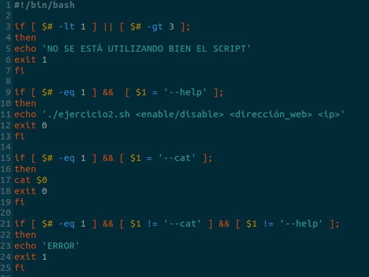
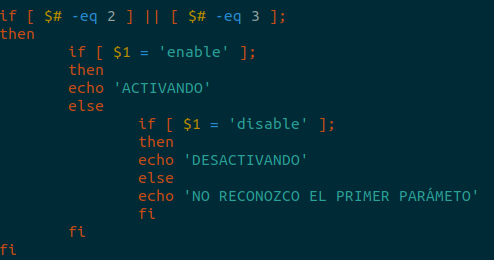

# EXAMEN DAW 1ª EVALUACIÓN EJ 2

[Javier Hermoso](https://github.com/hermo18)

### RESUMEN

En este documento se va a explicar como realizar un scripten **Bash** que configure el archivo hosts y lo habilite para crear un servidor desde nuestro ordenador con ayuda de **Apache**.

### PALABRAS CLAVE

* Examen
* Ayuda
* Bash
* Help
* Cat

## ÍNDICE

1. Introducción  
  1.1. ¿Qué es BASH?   
2. EJERICIO  
  2.1. Comprobación de parámetros y ayuda  
    2.2. Comprobación de que el primer parámetro sea correcto
3. Conclusión
4. Bibliografía

## ¿QUÉ ES BASH?
GNU Bash o simplemente Bash (Bourne-again shell) es una popular interfaz de usuario de línea de comandos, específicamente un shell de Unix; así como un lenguaje de scripting. Bash fue originalmente escrito por Brian Fox para el sistema operativo GNU, y pretendía ser el reemplazo de software libre del shell Bourne.

## COMPROBACIÓN DE PARÁMETROS Y AYUDA 

Lo que queremos comprobar actualmente es si el número de parámetros introducidos es correcto y en el caso de que sea 1 que compruebe si el usuario quiere consultar la ayuda o el código entero: 

## COMPROBACIÓN DE QUE EL PRIMER PARÁMETRO SEA CORRECTO 

Si se introducen 2 o 3 parámetros, el primer parámetro solo puede ser "enable" o "disable", esto es lo que comprueba esta parte del script: 

## 3. CONLUSIÓN
Para concluir, en mi opinión, la reaalización de este ejercicio puede ser un poco engorroso la primera vez pero es una manera rápida de configurar el archivo hosts de un ordenador sin entrar directamente en él.

## 4. BIBLIOGRAFÍA
- [COMANDOS BASH](https://es.wikipedia.org/wiki/Bash)
- [PARÁMETROS BASH](https://likegeeks.com/es/scripting-de-bash-parametros-y-opciones/)
- [IF BASH](https://atareao.es/tutorial/scripts-en-bash/condicionales-en-bash/)