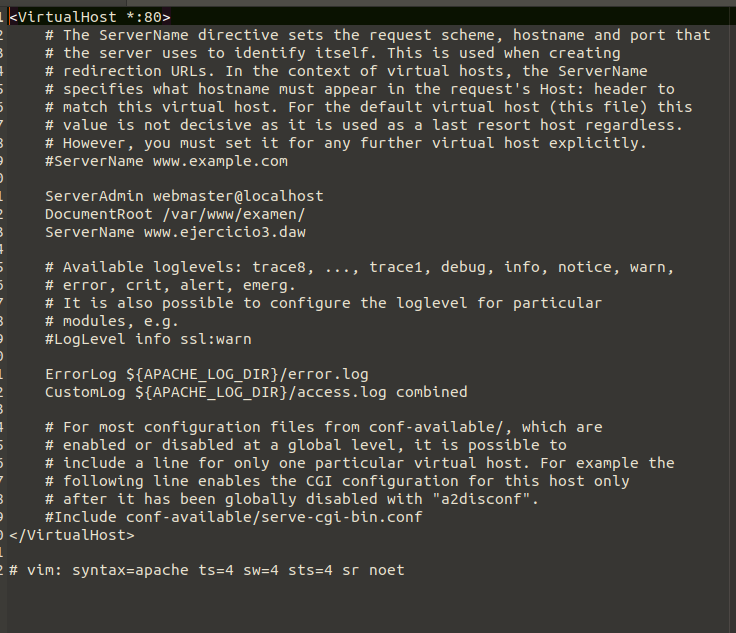
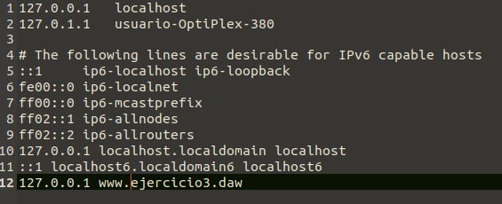
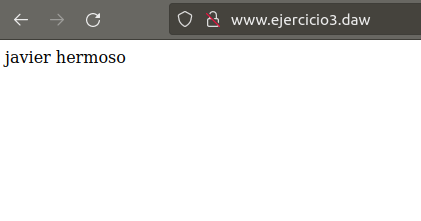

# EXAMEN DAW 1ª EVALUACIÓN EJ 3

Como **Apache** ya está instalado en el sistema y se inicia directamente, podemos pasar directamente a la configuración de la dirección del servidor.

### 2.1. CONFIGURACIÓN

Para poder tener nuestro servidor web con la dirección **www.ejercicio3.com** deberemos modicicar el archivo hosts y el gci.conf.

El archivo **gci** deberá de quedar de esta manera.

Deberemos cambiar el **ServerName** y poner la dirección nombrada anteriormente.

El archivo **hosts** deberá de quedar de esta manera.

La última línea deberá de ser como la vista en la imágen.

Para activar estos cambios deberemos de poner los siguientes comandos:

>a2ensite gci.conf  
>systemctl reload apache2

Y el resultado debe de ser este: 

